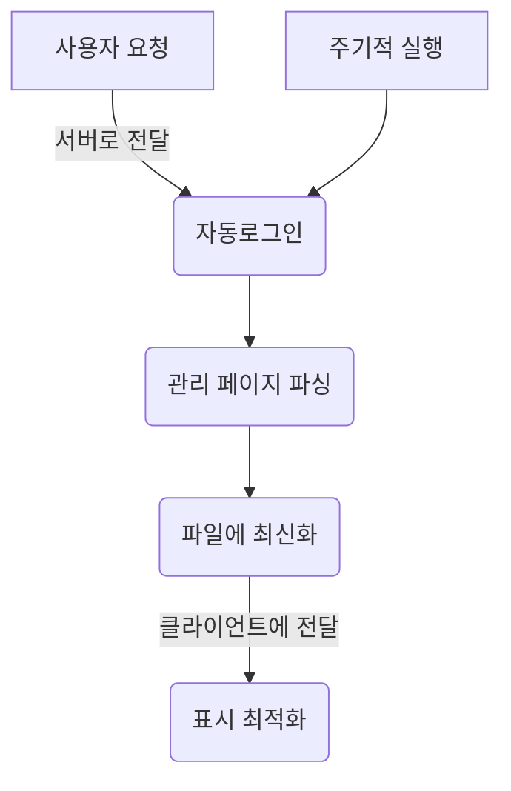

# 개요
블로그 댓글 내용을 보기 좋게 정리한다

## 배경
블로그 알림 시스템은 댓글 알림을 포스트로 묶어 포스트당 하나의 알림만 표시된다. 모든 댓글을 확인할 수 있는 페이지가 기존에 존재하나 가독성이 좋지 않다. 

### 기존 페이지의 문제점
 1. 블로그 관리 탭에서 찾아야하는 불편함
 2. 댓글의 내용이 앞부분 일부만 표시됨
 3. 포스트당 그루핑 되지 않음
 4. 내가 쓴 댓글과 받은 댓글이 구분되지 않음

### 시도한 것
> html 작성
1. 관리 페이지를 iframe으로 열어 데이터를 파싱하여 표시한다. 
	- 관리페이지에 접속하는 경우 top.href를 수정하는 스크립트를 이용하여 로그인 페이지로 이동하므로 iframe 외부의 전체 페이지가 갱신되어 실패함.
2. 네이버 로그인 API를 사용해 관리 페이지를 팝업창에 표시하고, 팝업창의 데이터를 파싱하여 표시한다. 
	- 제작한 페이지와 관리 페이지의 도메인이 일치하지 않아 데이터에 접근할 수 없어 실패함. 

> 서버 프로그램 작성 (python flask)
- 서버에서 네이버 로그인 API를 사용해 토큰을 획득하고, 해당 토큰으로 관리 페이지에 접속하여 데이터에 접근한다. 
	- 서버에서 request를 사용하여 토큰을 얻는 과정까지는 제대로 동작했으나 관리 페이지에 접근할 때 request로는 script를 실행시킬 수 없어 실패함. 
	- playwight를 이용해 접근하는 방법은 토큰을 전달해도 다시 로그인 페이지로 연결되어 실패함. 

### 접근 방향
1. 서버


- 관리 페이지에 접근하려면 script를 실행할 수 있는 방법을 사용해야한다 -> 네이버 로그인 API 보다 셀레니움으로 직접 로그인 하는게 더 쉽다. 

2. 모바일 앱
- 앱개발에 사용하는 웹뷰는 자바스크립트 삽입이 용이했던 기억. 
- 네이버 로그인 API도 모바일 개발용으로 사용해본 적 있다. 

3. 브라우저 확장기능
- 로그인/페이지 접속 과정을 사용자에게 맡기고 화면 최적화만 실시. 

## 설계
> 브라우저 확장기능 개발

파이어폭스 - Tampermonkey 사용
### 기능
1. 포스트 별 댓글 그루핑
2. 댓글 작성시간 역순 정렬
3. 링크로 바로가기
4. 내가 쓴 댓글 구분
5. 댓글 전문 표시

### 문제
`나는 자바스크립트를 쓸 줄 모른다`
하지만 ChatGPT와 함께라면 능통하지.

### 개발

1. 우선 페이지에 표시된 정보를 가져올 방법
dom 에서 그냥 가져오면 될 줄 알았는데 tampermonkey에서 실행시키면 못찾고 콘솔에서 그냥 입력하면 찾아온다. 

 > 아이프레임 이슈~
 
 ``` js
    const iframe = document.querySelector('iframe.content_iframe');

    if (iframe) {
		// iframe 로드가 완료된 후 작업 수행
        iframe.onload = function() {

            const iframeDoc = iframe.contentDocument || iframe.contentWindow.document;

            const commentTable = iframeDoc.querySelector('table.table3');
```

2. 데이터 파싱

테이블에 포함된 데이터 종류
- 작성자 닉네임
- 작성자 아이디
- 포스트 제목
- 포스트 링크
- 댓글 내용(일부/전체)
- 댓글 작성 시간


![[{889E30EC-3F70-4F77-B98B-9BDD1775878F}.png]]
일단 다 변수에 저장해서 콘솔로 찍어봄
``` js 
const rows = commentTable.querySelectorAll('tr');

  

rows.forEach((row, index) => {

    console.log(`Row ${index + 1}:==========================================================`);

    const tds = row.querySelectorAll('td');

    const commentWriterArr = tds[1].innerText.split('\n').filter(line => line.trim() !== '');

    const commentWriter = `${commentWriterArr[0]}(${commentWriterArr[1]})`;

  

    const [postTitle, commentShort, commentTime] = tds[2].innerText.split('\n').filter(line => line.trim() !== '');

    const postAddr = tds[2].querySelector('a').href;

    const comment = tds[2].querySelector('span._replyRealContents').innerText;


```


3. 블로그 주인 id 찾기: 관리페이지 화면에서 가져옴
``` js
    const userID = (window.location.href.match(/https:\/\/admin\.blog\.naver\.com\/([^\/]+)\/userfilter\/commentlist/) || [])[1] || "userID";
```

4. 데이터 구조화
``` json
{
    "223702236028": {
        postTitle: "난항의 일기",
        postAddr: "https://blog.naver.com/nox-a/223702236028",
        comments: [
            {
                commentWriter: "녹사<br>nox-a",
                comment: "댓글내용전문",
                commentTime: "2024.12.23. 19:24"
            },
            {
                commentWriter: "녹사<br>nox-a",
                comment: "댓글내용전문",
                commentTime: "2024.12.23. 19:24"
            },
        ]
    },
    "g81": {
        postTitle: "안부글제목은안부글의앞부분발췌이..",
        postAddr: "https://blog.naver.com/guestbook/GuestBookList.naver?blogId=nox-a&guestbookNo=81",
        comments: [
            {
                commentWriter: "녹사<br>nox-a",
                comment: "댓글내용전문",
                commentTime: "2024.12.23. 19:24"
            },
        ]
    }
}


```


4. 테이블을 만들고 모달에 표시 
![[{845BE0D9-80AB-4EB7-8849-115C5404DAD6}.png]]

아무튼 표시는 했거든요. 이거 이제 디자인의 문제로 넘어가야합니다. 
